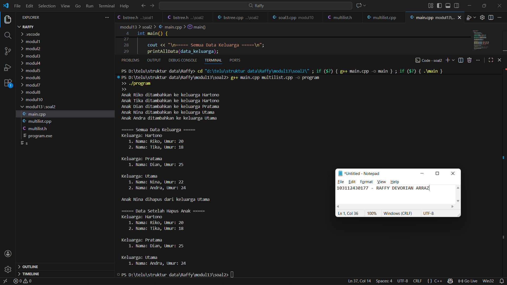
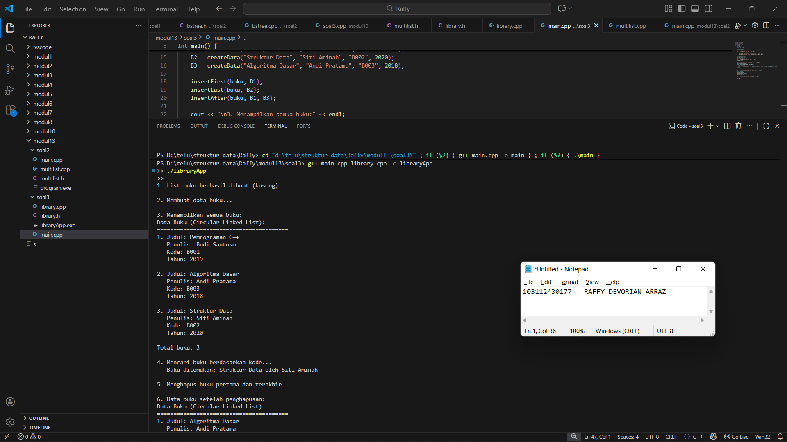

# <h1 align="center">Laporan Praktikum Modul 13 <br> Multi Linked List </h1>
<p align="center">103112430177 - RAFFY DEVORIAN ARRAZ</p>

## Dasar Teori
Multi Linked List adalah pengembangan dari linked list biasa di mana setiap elemen induk dapat memiliki list anak yang terhubung. Struktur ini memungkinkan representasi hubungan hierarkis antar data, misalnya hubungan pegawai dan anaknya, sehingga setiap node induk menyimpan informasi dan pointer ke node berikutnya serta pointer ke list anak. Dengan cara ini, operasi seperti tambah, hapus, dan pencarian bisa dilakukan baik pada level induk maupun anak secara efisien, sehingga cocok untuk mengelola data yang memiliki relasi satu-ke-banyak.
## Guide

```go
#include <iostream>
#include <string>
using namespace std;

struct ChildNode
{
    string info;
    ChildNode *next;
};

struct ParentNode
{
    string info;
    ChildNode *childHead;
    ParentNode *next;
};

ParentNode *createParent(string info)
{
    ParentNode *newNode = new ParentNode;
    newNode->info = info;
    newNode->childHead = NULL;
    newNode->next = NULL;
    return newNode;
}

ChildNode *createChild(string info)
{
    ChildNode *newNode = new ChildNode;
    newNode->info = info;
    newNode->next = NULL;
    return newNode;
}

void insertParent(ParentNode *&head, string info)
{
    ParentNode *newNode = createParent(info);
    if (head == NULL)
    {
        head = newNode;
    }
    else
    {
        ParentNode *temp = head;
        while (temp->next != NULL)
        {
            temp = temp->next;
        }
        temp->next = newNode;
    }
}

void insertChild(ParentNode *head, string parentInfo, string childInfo)
{
    ParentNode *p = head;
    while (p != NULL && p->info != parentInfo)
    {
        p = p->next;
    }
    
    if (p != NULL)
    {
        ChildNode *newChild = createChild(childInfo);
        
        if (p->childHead == NULL)
        {
            p->childHead = newChild;
        }
        else
        {
            ChildNode *c = p->childHead;
            while (c->next != NULL)
            {
                c = c->next;
            }
            c->next = newChild;
        }
    }
}

void printAll(ParentNode *head)
{
    ParentNode *p = head;
    while (p != NULL)
    {
        cout << p->info;
        ChildNode *c = p->childHead;
        if (c != NULL)
        {
            while (c != NULL)
            {
                cout << " -> " << c->info;
                c = c->next;
            }
        }
     cout << endl;
        p = p->next;
    }
}

int main()
{
    ParentNode *list = NULL;
    
    insertParent(list, "Parent Node 1");
    insertParent(list, "Parent Node 2");
    
    printAll(list);
    cout << "\n";
    
    insertChild(list, "Parent Node 1", "Child Node A");
    insertChild(list, "Parent Node 1", "Child Node B");
    insertChild(list, "Parent Node 2", "Child Node C");
    
    printAll(list);
    
    return 0;
}
```


## Unguide

### Soal 2
Perhatikan program 46 multilist.h, buat multilist.cpp untuk implementasi semua fungsi pada
multilist.h. Buat main.cpp untuk pemanggilan fungsi-fungsi tersebut.

## multilist.h

```go
#ifndef MULTILIST_H
#define MULTILIST_H

#include <iostream>
using namespace std;

// Struktur Child
struct infotype_child {
    string nama;
    int umur;
};

typedef struct elmlist_child *address_child;

struct elmlist_child {
    infotype_child info;
    address_child next;
    address_child prev;
};

// Struktur Parent
struct infotype_parent {
    string nama_keluarga;
    address_child first_child;
};

typedef struct elmlist_parent *address_parent;

struct elmlist_parent {
    infotype_parent info;
    address_parent next;
};

struct List_parent {
    address_parent first;
};

// Fungsi Child
void createListChild(address_child &L);
address_child createElmChild(infotype_child data);
void insertFirstChild(address_child &L, address_child P);
void insertLastChild(address_child &L, address_child P);
void printListChild(address_child L);
address_child searchChild(address_child L, string nama);
void deleteFirstChild(address_child &L, address_child &P);
void deleteAfterChild(address_child Prec, address_child &P);

// Fungsi Parent
void createListParent(List_parent &L);
address_parent createElmParent(infotype_parent data);
void insertLastParent(List_parent &L, address_parent P);
void printListParent(List_parent L);
address_parent searchParent(List_parent L, string nama_keluarga);

// Fungsi Tambahan
void addChildToParent(List_parent &L, string nama_keluarga, infotype_child data_child);
void printAllData(List_parent L);
void deleteChildFromParent(List_parent &L, string nama_keluarga, string nama_child);

#endif
```

## multilist.cpp

```go
#include "multilist.h"

// ===== CHILD =====
void createListChild(address_child &L) {
    L = NULL;
}

address_child createElmChild(infotype_child data) {
    address_child P = new elmlist_child;
    P->info = data;
    P->next = NULL;
    P->prev = NULL;
    return P;
}

void insertFirstChild(address_child &L, address_child P) {
    if (L == NULL) {
        L = P;
    } else {
        P->next = L;
        L->prev = P;
        L = P;
    }
}

void insertLastChild(address_child &L, address_child P) {
    if (L == NULL) {
        L = P;
    } else {
        address_child Q = L;
        while (Q->next != NULL) Q = Q->next;
        Q->next = P;
        P->prev = Q;
    }
}

void printListChild(address_child L) {
    if (L == NULL) {
        cout << "   (Tidak ada anak)\n";
        return;
    }
    address_child P = L;
    int i = 1;
    while (P != NULL) {
        cout << "   " << i << ". Nama: " << P->info.nama << ", Umur: " << P->info.umur << endl;
        P = P->next;
        i++;
    }
}

address_child searchChild(address_child L, string nama) {
    address_child P = L;
    while (P != NULL) {
        if (P->info.nama == nama) return P;
        P = P->next;
    }
    return NULL;
}

void deleteFirstChild(address_child &L, address_child &P) {
    if (L != NULL) {
        P = L;
        if (L->next == NULL) L = NULL;
        else {
            L = L->next;
            L->prev = NULL;
            P->next = NULL;
        }
    }
}

void deleteAfterChild(address_child Prec, address_child &P) {
    if (Prec != NULL && Prec->next != NULL) {
        P = Prec->next;
        Prec->next = P->next;
        if (P->next != NULL) P->next->prev = Prec;
        P->next = NULL;
        P->prev = NULL;
    }
}

// ===== PARENT =====
void createListParent(List_parent &L) {
    L.first = NULL;
}

address_parent createElmParent(infotype_parent data) {
    address_parent P = new elmlist_parent;
    P->info = data;
    P->info.first_child = NULL;
    P->next = NULL;
    return P;
}

void insertLastParent(List_parent &L, address_parent P) {
    if (L.first == NULL) L.first = P;
    else {
        address_parent Q = L.first;
        while (Q->next != NULL) Q = Q->next;
        Q->next = P;
    }
}

void printListParent(List_parent L) {
    if (L.first == NULL) {
        cout << "(Tidak ada keluarga)\n";
        return;
    }
    address_parent P = L.first;
    int i = 1;
    while (P != NULL) {
        cout << i << ". Keluarga: " << P->info.nama_keluarga << endl;
        P = P->next;
        i++;
    }
}

address_parent searchParent(List_parent L, string nama_keluarga) {
    address_parent P = L.first;
    while (P != NULL) {
        if (P->info.nama_keluarga == nama_keluarga) return P;
        P = P->next;
    }
    return NULL;
}

// ===== TAMBAH & HAPUS CHILD =====
void addChildToParent(List_parent &L, string nama_keluarga, infotype_child data_child) {
    address_parent parent = searchParent(L, nama_keluarga);
    if (parent != NULL) {
        address_child new_child = createElmChild(data_child);
        insertLastChild(parent->info.first_child, new_child);
        cout << "Anak " << data_child.nama << " ditambahkan ke keluarga " << nama_keluarga << endl;
    } else cout << "Keluarga " << nama_keluarga << " tidak ditemukan!\n";
}

void printAllData(List_parent L) {
    address_parent P = L.first;
    if (P == NULL) {
        cout << "Tidak ada data keluarga.\n";
        return;
    }
    while (P != NULL) {
        cout << "Keluarga: " << P->info.nama_keluarga << endl;
        printListChild(P->info.first_child);
        P = P->next;
        cout << endl;
    }
}

void deleteChildFromParent(List_parent &L, string nama_keluarga, string nama_child) {
    address_parent parent = searchParent(L, nama_keluarga);
    if (parent != NULL) {
        address_child child = searchChild(parent->info.first_child, nama_child);
        if (child != NULL) {
            if (child == parent->info.first_child) {
                address_child del;
                deleteFirstChild(parent->info.first_child, del);
                delete del;
            } else {
                address_child prec = parent->info.first_child;
                while (prec->next != child) prec = prec->next;
                address_child del;
                deleteAfterChild(prec, del);
                delete del;
            }
            cout << "Anak " << nama_child << " dihapus dari keluarga " << nama_keluarga << endl;
        } else cout << "Anak " << nama_child << " tidak ditemukan.\n";
    } else cout << "Keluarga " << nama_keluarga << " tidak ditemukan.\n";
}
```

## main.cpp

```go
#include "multilist.h"
#include <cstdlib>

int main() {
    List_parent data_keluarga;
    createListParent(data_keluarga);

    // Contoh data berbeda
    infotype_parent keluarga1 = {"Hartono", NULL};
    infotype_parent keluarga2 = {"Pratama", NULL};
    infotype_parent keluarga3 = {"Utama", NULL};

    address_parent p1 = createElmParent(keluarga1);
    address_parent p2 = createElmParent(keluarga2);
    address_parent p3 = createElmParent(keluarga3);

    insertLastParent(data_keluarga, p1);
    insertLastParent(data_keluarga, p2);
    insertLastParent(data_keluarga, p3);

    // Tambah anak
    addChildToParent(data_keluarga, "Hartono", {"Riko", 20});
    addChildToParent(data_keluarga, "Hartono", {"Tika", 18});
    addChildToParent(data_keluarga, "Pratama", {"Dian", 25});
    addChildToParent(data_keluarga, "Utama", {"Nina", 22});
    addChildToParent(data_keluarga, "Utama", {"Andra", 24});

    cout << "\n===== Semua Data Keluarga =====\n";
    printAllData(data_keluarga);

    // Hapus anak
    deleteChildFromParent(data_keluarga, "Utama", "Nina");

    cout << "\n===== Data Setelah Hapus Anak =====\n";
    printAllData(data_keluarga);

    return 0;
}
```

> Output
> 

Multi Linked List adalah struktur data yang mengembangkan konsep linked list biasa dengan memungkinkan setiap elemen induk memiliki list anak yang terhubung, sehingga membentuk hubungan hierarkis. Struktur ini memudahkan pengelolaan data yang memiliki relasi satu-ke-banyak, seperti data keluarga dengan anggota, karena setiap node induk menyimpan informasi dan pointer ke node anak. Dengan Multi Linked List, operasi seperti menambah, menghapus, dan mencari data dapat dilakukan baik di level induk maupun anak secara efisien, sehingga sangat cocok untuk mengorganisasi data kompleks yang memiliki keterkaitan antar elemen.

### Soal 3
Buatlah implementasi ADT Doubly Linked list pada file “circularlist.cpp”. Tambahkan fungsi/prosedur berikut pada file “main.cpp”.

• fungsi create ( in nama, nim : string, jenis_kelamin : char, ipk : float)
• fungsi disediakan, ketik ulang code yang diberikan
• fungsi mengalokasikan sebuah elemen list dengan info sesuai input

## circular.h
```go
#ifndef LIBRARY_H
#define LIBRARY_H

#include <iostream>
#include <string>
using namespace std;

struct infotype {
    string judul;
    string penulis;
    string kode;
    int tahun;
};

typedef struct elmlist* address;

struct elmlist {
    infotype info;
    address next;
};

struct List {
    address first;
};

// Fungsi list
void createList(List &L);
address alokasi(infotype x);
void dealokasi(address &P);
void insertFirst(List &L, address P);
void insertAfter(List &L, address Prec, address P);
void insertLast(List &L, address P);
void deleteFirst(List &L, address &P);
void deleteAfter(List &L, address Prec, address &P);
void deleteLast(List &L, address &P);
address findElm(List L, infotype x);
void printInfo(List L);

// Membuat data baru
address createData(string judul, string penulis, string kode, int tahun);

#endif
```

## circular.cpp
```go
#include "library.h"

// Membuat list kosong
void createList(List &L) {
    L.first = NULL;
}

// Alokasi node
address alokasi(infotype x) {
    address P = new elmlist;
    P->info = x;
    P->next = NULL;
    return P;
}

// Dealokasi node
void dealokasi(address &P) {
    delete P;
    P = NULL;
}

// Insert pertama
void insertFirst(List &L, address P) {
    if (L.first == NULL) {
        L.first = P;
        P->next = P;
    } else {
        address last = L.first;
        while (last->next != L.first) last = last->next;
        P->next = L.first;
        L.first = P;
        last->next = P;
    }
}

// Insert setelah node tertentu
void insertAfter(List &L, address Prec, address P) {
    if (Prec != NULL) {
        P->next = Prec->next;
        Prec->next = P;
    }
}

// Insert terakhir
void insertLast(List &L, address P) {
    if (L.first == NULL) {
        L.first = P;
        P->next = P;
    } else {
        address last = L.first;
        while (last->next != L.first) last = last->next;
        last->next = P;
        P->next = L.first;
    }
}

// Delete pertama
void deleteFirst(List &L, address &P) {
    if (L.first != NULL) {
        P = L.first;
        if (L.first->next == L.first) {
            L.first = NULL;
        } else {
            address last = L.first;
            while (last->next != L.first) last = last->next;
            L.first = L.first->next;
            last->next = L.first;
            P->next = NULL;
        }
    }
}

// Delete setelah node tertentu
void deleteAfter(List &L, address Prec, address &P) {
    if (Prec != NULL && Prec->next != NULL) {
        P = Prec->next;
        Prec->next = P->next;
        P->next = NULL;
    }
}

// Delete terakhir
void deleteLast(List &L, address &P) {
    if (L.first != NULL) {
        if (L.first->next == L.first) {
            P = L.first;
            L.first = NULL;
        } else {
            address last = L.first, prev = NULL;
            while (last->next != L.first) {
                prev = last;
                last = last->next;
            }
            P = last;
            prev->next = L.first;
        }
    }
}

// Cari node berdasarkan kode buku
address findElm(List L, infotype x) {
    if (L.first == NULL) return NULL;
    address P = L.first;
    do {
        if (P->info.kode == x.kode) return P;
        P = P->next;
    } while (P != L.first);
    return NULL;
}

// Print semua data
void printInfo(List L) {
    if (L.first == NULL) {
        cout << "List kosong" << endl;
        return;
    }
    address P = L.first;
    int i = 1;
    cout << "Data Buku (Circular Linked List):" << endl;
    cout << "========================================" << endl;
    do {
        cout << i << ". Judul: " << P->info.judul << endl;
        cout << "   Penulis: " << P->info.penulis << endl;
        cout << "   Kode: " << P->info.kode << endl;
        cout << "   Tahun: " << P->info.tahun << endl;
        cout << "----------------------------------------" << endl;
        P = P->next;
        i++;
    } while (P != L.first);
    cout << "Total buku: " << i-1 << endl;
}

// Membuat data buku baru
address createData(string judul, string penulis, string kode, int tahun) {
    infotype x;
    x.judul = judul;
    x.penulis = penulis;
    x.kode = kode;
    x.tahun = tahun;
    return alokasi(x);
}
```

## main.cpp
```go
#include "library.h"
#include <iostream>
using namespace std;

int main() {
    List buku;
    address B1, B2, B3;

    createList(buku);
    cout << "1. List buku berhasil dibuat (kosong)" << endl;

    cout << "\n2. Membuat data buku..." << endl;

    B1 = createData("Pemrograman C++", "Budi Santoso", "B001", 2019);
    B2 = createData("Struktur Data", "Siti Aminah", "B002", 2020);
    B3 = createData("Algoritma Dasar", "Andi Pratama", "B003", 2018);

    insertFirst(buku, B1);
    insertLast(buku, B2);
    insertAfter(buku, B1, B3);

    cout << "\n3. Menampilkan semua buku:" << endl;
    printInfo(buku);

    cout << "\n4. Mencari buku berdasarkan kode..." << endl;
    infotype searchData;
    searchData.kode = "B002";
    address found = findElm(buku, searchData);
    if (found != NULL) {
        cout << "   Buku ditemukan: " << found->info.judul << " oleh " << found->info.penulis << endl;
    } else {
        cout << "   Buku tidak ditemukan" << endl;
    }

    cout << "\n5. Menghapus buku pertama dan terakhir..." << endl;
    address deleted;
    deleteFirst(buku, deleted);
    dealokasi(deleted);
    deleteLast(buku, deleted);
    dealokasi(deleted);

    cout << "\n6. Data buku setelah penghapusan:" << endl;
    printInfo(buku);

    return 0;
}
```

> Output
> 

Program ini menggunakan struktur data circular linked list untuk menyimpan informasi buku di perpustakaan, di mana setiap node menyimpan data seperti judul, kode buku, jenis, dan harga. Circular linked list dipilih agar elemen terakhir selalu terhubung kembali ke elemen pertama, mempermudah traversal dan manipulasi data tanpa perlu memeriksa akhir list. Program memungkinkan penambahan data di awal, akhir, atau setelah node tertentu, pencarian berdasarkan kode buku, penghapusan data, serta menampilkan semua data dengan rapi. Dengan cara ini, manajemen koleksi buku menjadi lebih terstruktur, efisien, dan mudah dioperasikan.

## Referensi
1. https://www.w3schools.com/dsa/dsa_data_linkedlists_types.php
2. https://www.w3schools.com/dsa/trydsa.php?filename=demo_linkedlists_circsingly
