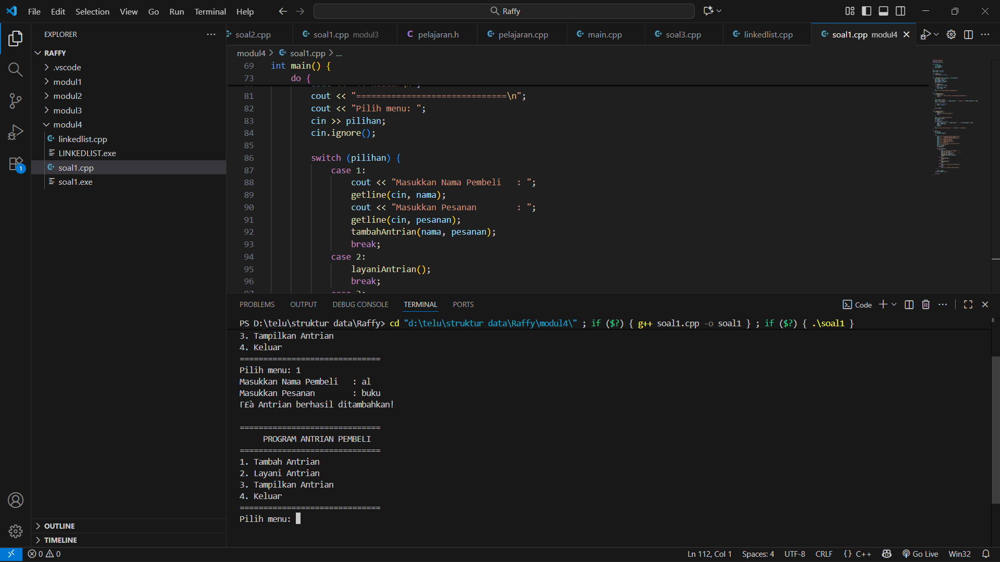
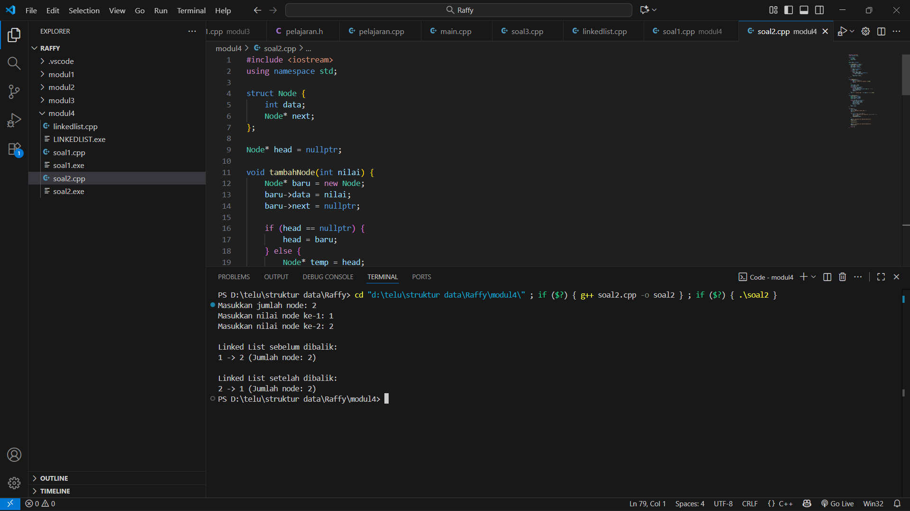

# <h1 align="center">Laporan Praktikum Modul 4 <br> SINGLY LINKED LIST (BAGIAN PERTAMA)</h1>
<p align="center">Raffy Devorian Arraz - 103112430177 </p>

## Dasar Teori

Singly Linked List adalah **struktur data dinamis** yang terdiri dari sejumlah node yang saling terhubung secara linear, di mana setiap node menyimpan data serta pointer yang menunjuk ke node berikutnya, membentuk rantai satu arah yang berakhir pada `NULL`. Struktur ini memudahkan **penambahan dan penghapusan elemen** secara efisien tanpa perlu menggeser data. Operasi dasarnya mencakup **penyisipan, penghapusan, pencarian, dan pembaruan** data, yang semuanya dikelola melalui pointer untuk mengatur hubungan antar node.

## Guided

### LINKEDLIST.CPP
```go
#include <iostream>
using namespace std;

// Struktur Node
struct Node {
    int data;
    Node* next;
};

// Pointer awal dan akhir
Node* head = nullptr;

// Fungsi untuk membuat node baru
Node* createNode(int data) {
    Node* newNode = new Node();
    newNode->data = data;
    newNode->next = nullptr;
    return newNode;
}


void insertBelakang(int data) {
    Node* newNode = createNode(data);
    if (head == nullptr) {
        head = newNode;
    } else {
        Node* temp = head;
        while (temp->next != nullptr) {
            temp = temp->next;
        }
        temp->next = newNode;
    }
    cout << "Data " << data << " berhasil ditambahkan di belakang.\n";
}

void insertSetelah(int target, int dataBaru) {
    Node* temp = head;
    while (temp != nullptr && temp->data != target) {
        temp = temp->next;
    }

    if (temp == nullptr) {
        cout << "Data " << target << " tidak ditemukan!\n";
    } else {
        Node* newNode = createNode(dataBaru);
        newNode->next = temp->next;
        temp->next = newNode;
        cout << "Data " << dataBaru << " berhasil disisipkan setelah " << target << ".\n";
    }
}

// ========== DELETE FUNCTION ==========
void hapusNode(int data) {
    if (head == nullptr) {
        cout << "List kosong!\n";
        return;
    }

    Node* temp = head;
    Node* prev = nullptr;

    // Jika data di node pertama
    if (temp != nullptr && temp->data == data) {
        head = temp->next;
        delete temp;
        cout << "Data " << data << " berhasil dihapus.\n";
        return;
    }

    // Cari node yang akan dihapus
    while (temp != nullptr && temp->data != data) {
        prev = temp;
        temp = temp->next;
    }

    // Jika data tidak ditemukan
    if (temp == nullptr) {
        cout << "Data " << data << " tidak ditemukan!\n";
        return;
    }

    prev->next = temp->next;
    delete temp;
    cout << "Data " << data << " berhasil dihapus.\n";
}

// ========== UPDATE FUNCTION ==========
void updateNode(int dataLama, int dataBaru) {
    Node* temp = head;
    while (temp != nullptr && temp->data != dataLama) {
        temp = temp->next;
    }

    if (temp == nullptr) {
        cout << "Data " << dataLama << " tidak ditemukan!\n";
    } else {
        temp->data = dataBaru;
        cout << "Data " << dataLama << " berhasil diupdate menjadi " << dataBaru << ".\n";
    }
}

// ========== DISPLAY FUNCTION ==========
void tampilkanList() {
    if (head == nullptr) {
        cout << "List kosong!\n";
        return;
    }

    Node* temp = head;
    cout << "Isi Linked List: ";
    while (temp != nullptr) {
        cout << temp->data << " -> ";
        temp = temp->next
    }
    cout << "NULL\n";
}

// ========== MAIN PROGRAM ==========
int main() {
    int pilihan, data, target, dataBaru;

    do {
        cout << "\n=== MENU SINGLE LINKED LIST ===\n";
        cout << "1. Insert Depan\n";
        cout << "2. Insert Belakang\n";
        cout << "3. Insert Setelah\n";
        cout << "4. Hapus Data\n";
        cout << "5. Update Data\n";
        cout << "6. Tampilkan List\n";
        cout << "0. Keluar\n";
        cout << "Pilih: ";
        cin >> pilihan;

        switch (pilihan) {
            case 1:
                cout << "Masukkan data: ";
                cin >> data;
                insertDepan(data);
                break;
            case 2:
                cout << "Masukkan data: ";
                cin >> data;
                insertBelakang(data);
                break;
            case 3:
                cout << "Masukkan data target: ";
                cin >> target;
                cout << "Masukkan data baru: ";
                cin >> dataBaru;
                insertSetelah(target, dataBaru);
                break;
            case 4:
                cout << "Masukkan data yang ingin dihapus: ";
                cin >> data;
                hapusNode(data);
                break;
            case 5:
                cout << "Masukkan data lama: ";
                cin >> data;
                cout << "Masukkan data baru: ";
                cin >> dataBaru;
                updateNode(data, dataBaru);
                break;
            case 6:
                tampilkanList();
                break;
            case 0:
                cout << "Program selesai.\n";
                break;
            default:
                cout << "Pilihan tidak valid!\n";
        }
    } while (pilihan != 0);

    return 0;
}
```

## Unguided

### Soal 1

buatlah single linked list untuk Antrian yang menyimpan data pembeli( nama dan pesanan). program memiliki beberapa menu seperti tambah antrian,  layani antrian(hapus), dan tampilkan antrian. \*antrian pertama harus yang pertama dilayani


```go
#include <iostream>
#include <string>
using namespace std;

struct Node {
    string nama;
    string pesanan;
    Node *next;
};

Node *front = nullptr;
Node *rear = nullptr;

bool isEmpty() {
    return front == nullptr;
}

void tambahAntrian(string nama, string pesanan) {
    Node *baru = new Node;
    baru->nama = nama;
    baru->pesanan = pesanan;
    baru->next = nullptr;

    if (isEmpty()) {
        front = rear = baru;
    } else {
        rear->next = baru;
        rear = baru;
    }
    cout << "✅ Antrian berhasil ditambahkan!\n";
}

void layaniAntrian() {
    if (isEmpty()) {
        cout << "⚠️  Antrian kosong, tidak ada yang dilayani!\n";
        return;
    }

    Node *hapus = front;
    cout << "👤 Melayani: " << hapus->nama << " - Pesanan: " << hapus->pesanan << endl;
    front = front->next;

    if (front == nullptr) {
        rear = nullptr; 
    }

    delete hapus;
}

void tampilAntrian() {
    if (isEmpty()) {
        cout << "📭 Antrian kosong!\n";
        return;
    }

    cout << "\n📋 Daftar Antrian:\n";
    Node *temp = front;
    int nomor = 1;
    int total = 0;
    while (temp != nullptr) {
        cout << nomor << ". " << temp->nama << " - " << temp->pesanan << endl;
        temp = temp->next;
        nomor++;
        total++;
    }
    cout << "Total antrian saat ini: " << total << " orang\n\n";
}

int main() {
    int pilihan;
    string nama, pesanan;

    do {
        cout << "==============================\n";
        cout << "     PROGRAM ANTRIAN PEMBELI  \n";
        cout << "==============================\n";
        cout << "1. Tambah Antrian\n";
        cout << "2. Layani Antrian\n";
        cout << "3. Tampilkan Antrian\n";
        cout << "4. Keluar\n";
        cout << "==============================\n";
        cout << "Pilih menu: ";
        cin >> pilihan;
        cin.ignore(); 

        switch (pilihan) {
            case 1:
                cout << "Masukkan Nama Pembeli   : ";
                getline(cin, nama);
                cout << "Masukkan Pesanan        : ";
                getline(cin, pesanan);
                tambahAntrian(nama, pesanan);
                break;
            case 2:
                layaniAntrian();
                break;
            case 3:
                tampilAntrian();
                break;
            case 4:
                cout << "👋 Keluar dari program.\n";
                break;
            default:
                cout << "❌ Pilihan tidak valid!\n";
        }

        cout << endl;
    } while (pilihan != 4);

    return 0;
}
```

> Output
> 
 
Program ini mengimplementasikan queue (antrian) menggunakan linked list untuk mencatat pembeli dan pesanan mereka. Node menyimpan nama dan pesanan, dengan pointer next menghubungkan node secara linear. Program menyediakan menu interaktif untuk menambahkan pembeli ke antrian (enqueue), melayani pembeli dari depan (dequeue), dan menampilkan seluruh antrian beserta jumlah orang yang sedang menunggu. Struktur linked list memungkinkan antrian bersifat dinamis tanpa batasan ukuran tetap, sehingga elemen bisa ditambahkan atau dihapus dengan mudah.

### Soal 2

buatlah program kode untuk membalik (reverse) singly linked list (1-2-3 menjadi 3-2-1) 

```go
#include <iostream>
using namespace std;

struct Node {
    int data;
    Node* next;
};

Node* head = nullptr;

void tambahNode(int nilai) {
    Node* baru = new Node;
    baru->data = nilai;
    baru->next = nullptr;

    if (head == nullptr) {
        head = baru;
    } else {
        Node* temp = head;
        while (temp->next != nullptr) {
            temp = temp->next;
        }
        temp->next = baru;
    }
}

void tampilList() {
    if (head == nullptr) {
        cout << "Linked List kosong." << endl;
        return;
    }

    Node* temp = head;
    int count = 0;
    while (temp != nullptr) {
        cout << temp->data;
        if (temp->next != nullptr) cout << " -> ";
        temp = temp->next;
        count++;
    }
    cout << " (Jumlah node: " << count << ")" << endl;
}

void reverseList() {
    Node* prev = nullptr;
    Node* current = head;
    Node* next = nullptr;

    while (current != nullptr) {
        next = current->next;   
        current->next = prev;   
        prev = current;         
        current = next;         
    }
    head = prev; 
}

int main() {
    int n, nilai;
    cout << "Masukkan jumlah node: ";
    cin >> n;

    for (int i = 0; i < n; i++) {
        cout << "Masukkan nilai node ke-" << i + 1 << ": ";
        cin >> nilai;
        tambahNode(nilai);
    }

    cout << "\nLinked List sebelum dibalik:\n";
    tampilList();

    reverseList();

    cout << "\nLinked List setelah dibalik:\n";
    tampilList();

    return 0;
}


```

> Output
> 

Program ini membuat singly linked list yang memungkinkan penambahan node secara dinamis di akhir list. Fitur utama meliputi menampilkan linked list dan membalik urutan node menggunakan pointer (reverseList). Dengan input dari pengguna, setiap node berisi nilai integer, dan setelah list dibalik, urutan node menjadi terbalik tanpa membuat list baru. Linked list ini efisien karena manipulasi elemen dilakukan melalui pointer tanpa memindahkan seluruh data di memori.

## Referensi

1. https://www.w3schools.com/cpp/cpp_for_loop_nested.asp
2. https://www.w3schools.com/cpp/cpp_arrays.asp
3. https://www.w3schools.com/cpp/cpp_arrays_loop.asp
4. https://www.w3schools.com/cpp/cpp_references.asp
5. https://www.w3schools.com/cpp/cpp_pointers.asp
